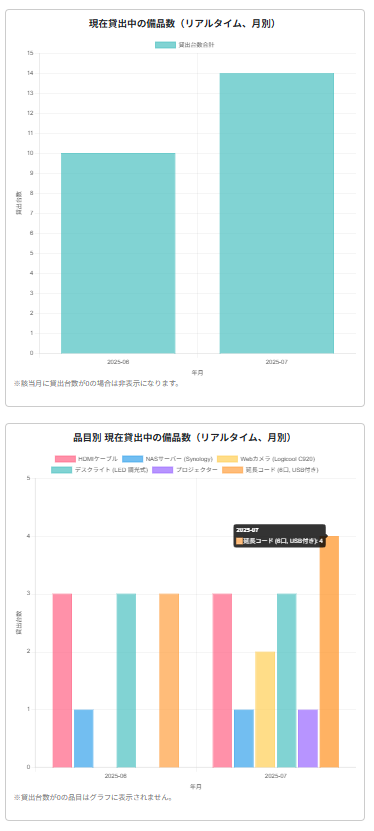

# 📦 Inventory Manager（備品管理アプリ）

個人開発で制作したDjango製の備品管理アプリです。  
ログイン機能、ユーザー管理や備品の貸出・返却機能、データの可視化を備えています。

---

## 🌐 アプリURL（本番環境）

🔗 https://inventory-app-x0qh.onrender.com  

---

## 👤 利用可能なユーザー（デモ用）

| 種別         | ユーザー名          | パスワード     |
|--------------|---------------------|----------------|
| 管理ユーザー | `demo_admin_user`   | `demo1234`     |
| 一般ユーザー | `demo_user`         | `DemoPass2025` |

※ 管理ユーザーはアプリ内の管理機能にアクセス可能ですが、Django管理画面へのアクセスはスーパーユーザーのみに制限されています。

---

## 🔒 本番環境での制限事項

- **新規登録はできません**  
  → 新規登録ボタンを押すと「現在、新規登録はできません」と表示されます。

- **パスワードリセットは無効化されています**  
  → 入力したメールアドレス宛にリセットメールは送信されません。

---

## 🛠 主な機能

- ユーザー登録・ログイン（※本番では制限あり）
- ユーザー種別によるダッシュボードの切り替え  
  - 管理者：全備品の閲覧・登録・貸出状況管理  
  - 一般ユーザー：自身が登録した備品と貸出状況のみ閲覧・操作可能
- 備品のCRUD（作成・更新・削除）
- 貸出・返却管理（貸出個数・返却予定日の指定）
- 月別の貸出数グラフの表示
- CSV / Excel / PDF 形式での出力（一般ユーザー・管理者ともに使用可能）


---

## 📸 スクリーンショット

### ログイン画面

アプリケーションの入口として、ユーザー認証を行うログイン画面です。  
ログイン後は、ユーザーの権限に応じて **一般ユーザーダッシュボードまたは管理者ダッシュボードにリダイレクト** されます。  
※本番環境では新規登録は無効化されています。


### 1. 貸出一覧表（ダッシュボード上部）

ユーザーが借用中の備品を一覧表示します。  
返却予定日や貸出個数などが確認でき、表下部には以下の**ファイル出力ボタン**を実装しています：

- 📄 CSV形式でのダウンロード
- 📊 Excel形式でのダウンロード
- 🖨️ PDF形式でのダウンロード（印刷対応）

これにより、ユーザーは自身の貸出状況を自由に保存・印刷できます。


### 2. リアルタイム貸出グラフ（ダッシュボード下部）
リアルタイムで更新される 2 種類のグラフを表示しています：

- 📅 現在貸出中の備品数
- 📦 品目別　現在貸出中の備品数




### 管理者ダッシュボード
ログイン後に表示される管理者用のメイン画面です。  
全体の貸出状況グラフのほか、管理機能にアクセスするためのボタンが配置されています。：

⚙️ 管理画面へ移動するためのボタン（Django管理サイトリンク）  
📄 全ユーザーの貸出履歴一覧ページへのリンクボタン  
📊 月別・リアルタイム集計の貸出中備品数（全ユーザー対象）グラフ  
📦 月別・リアルタイム集計の品目別貸出中備品数（全ユーザー対象）グラフ  

これにより、管理者はユーザー全体の貸出状況の把握や備品管理業務を一画面で効率的に行うことが可能です。


### 全ユーザーの貸出履歴一覧（出力機能付き）
管理者ダッシュボードのボタンから遷移できる、全ユーザーの貸出履歴を確認・出力できるページです。:

-  貸出状況を一覧で表示
- 📄 CSV形式でのダウンロード
- 📊 Excel形式でのダウンロード
- 🖨️ PDF形式でのダウンロード（印刷対応）


### 備品一覧画面（一般ユーザー）

一般ユーザーがダッシュボードの「備品一覧を確認・借りる」ボタンをクリックすると表示される画面です。    
各行の右端にある「貸出」ボタンから、貸出申請フォームへ進むことができます。


### 貸出申請フォーム（一般ユーザー）

「貸出」ボタンをクリックすると遷移する、貸出申請用の入力フォーム画面です。  
選択した備品について、以下の情報を入力して申請します：

- 貸出する個数  
- 返却予定日（カレンダーから選択）  


### データ出力機能　一例（PDF）

本アプリでは、一般ユーザー・管理者ともに以下の形式で貸出履歴のダウンロードが可能です。

- 📄 CSV形式でのダウンロード
- 📊 Excel形式でのダウンロード
- 🖨️ PDF形式でのダウンロード（印刷対応） 

以下は管理者用PDF出力の画面イメージの一例です。


---

## ⚙️ 使用技術

- Python 3.x  
- Django 4.x  
- PostgreSQL（開発・本番共通で使用）  
- Bootstrap / HTML / CSS（フロントエンド）  
- Docker（開発環境およびPostgreSQLコンテナ含む）  
- Render（アプリのデプロイ）  
- Supabase（PostgreSQLのホスティング）


---

## 📁 ローカルでのセットアップ（仮想環境を使う場合）

```bash
git clone https://github.com/TechCat-Hello/inventory-app.git
cd inventory-app
python -m venv venv
source venv/bin/activate  # Windowsの場合: venv\Scripts\activate
pip install -r requirements.txt
python manage.py migrate
python manage.py runserver
```

## 🐳 Docker を使用したセットアップ

Docker を使用してアプリを起動するには以下を実行してください。

```bash
git clone https://github.com/TechCat-Hello/inventory-app.git
cd inventory-app
docker compose up --build
```

初回起動後にマイグレーションと管理ユーザー作成を行います：
```bash
docker compose exec web python manage.py migrate
docker compose exec web python manage.py createsuperuser
```

## 🌐 アプリへのアクセス
アプリ本体: http://localhost:8000  
管理画面: http://localhost:8000/admin/

## ⚙️ 環境変数の設定
このアプリでは環境変数を `.env` ファイルで管理しています。  
以下の手順で `.env` ファイルを設定してください。

1. プロジェクトルートにある `.env.example` をコピーします：
    ```bash
    cp .env.example .env
    ```

2. `.env` を開いて、以下の項目を必要に応じて修正してください：

- `SECRET_KEY`：Djangoのシークレットキー
- `DEBUG`：本番環境では `False` にしてください
- `ALLOWED_HOSTS`：本番では Render などのドメインを追加
- `DATABASE_URL`：SupabaseなどのDB接続情報（本番環境のみ必要）
- メール送信設定（必要な場合のみ有効化）

---

## License
This project is licensed under the MIT License.  
See the [MIT License](./LICENSE) file for details.

## 📮 Author
TechCat  
GitHub: https://github.com/TechCat-Hello


